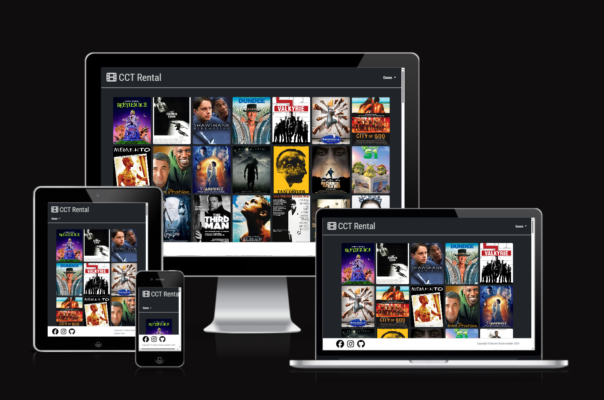
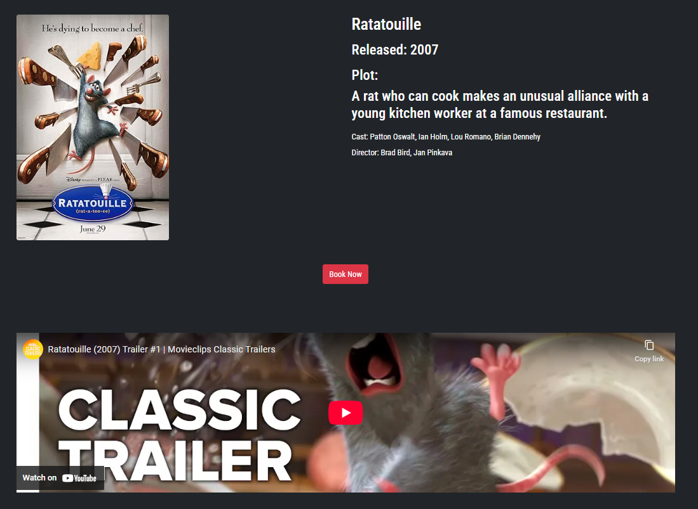
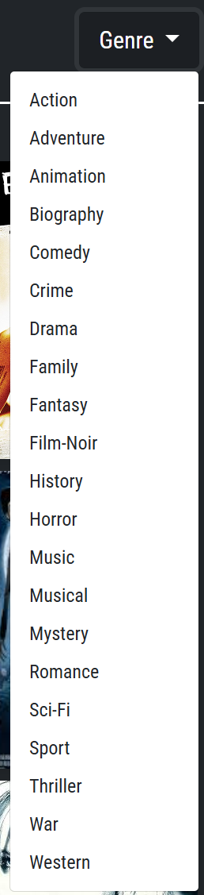

# 📽️ CCT Rental

A responsive movie rental web application built with HTML, CSS, Bootstrap, and JavaScript. Users can browse a gallery of films, filter by genre, view details about selected movies, and book them for rental.

## 📚 Table of Contents

- [User Experience](#-user-experience)
- [Features](#-features)
- [Images](#️-image-previews)
- [Technologies Used](#-technologies-used)
- [File Structure](#-file-structure)
- [Testing](#-testing)
- [Bugs, Issues and Solutions](#-bugs-issues-and-solutions)
- [Deployment](#-deployment)
- [Content](#content)

## 👤 User Experience

### Navigation and Layout

- The navbar and footer are modular components loaded dynamically using JavaScript (`navbar.js` and `footer.js`). This ensures consistency across all pages and simplifies updates.
- The navbar includes a responsive **Genre** dropdown powered by Bootstrap, allowing users to filter movies instantly without reloading the page.
- The footer includes links to social media and is styled to stay fixed at the bottom for accessibility.

### Homepage and Movie Browsing

- On the homepage (`index.html`), users are presented with a gallery of movies that can be filtered by genre using buttons from the dropdown.
- Filtering is handled by `filter_movies.js`, which loads data from a local `film.json` file and dynamically displays matching movies.
- Each movie poster links to a detailed page with more information.

### Movie Detail View

- On the detail page (`movie_detail.html`), JavaScript loads content based on the selected movie ID.
- The poster, plot, cast, director, and release year are all dynamically inserted.
- A YouTube trailer is embedded and adapted from the movie’s video URL.
- A clear and visible **Book Now** button leads to the booking form.

### Booking Experience

- On the booking page (`booking.html`), users can select the date, time, number of tickets, and enter their name and email.
- Input is validated in `booking_validation.js`. Invalid entries prompt specific error messages.
- Upon successful booking, a thank-you popup appears and the user is redirected to the homepage.

### Accessibility and Responsiveness

- The layout is built using Bootstrap grid classes and utility styles to ensure compatibility across screen sizes.
- Font choices (Roboto Condensed and Oswald) and color contrast ensure readability.
- Elements like buttons and inputs are large and clear enough for use on both desktop and mobile.

### Interactive Movie Gallery

- Users are presented with a grid of movie posters that can be filtered dynamically by genre.
- The filter is applied instantly without reloading the page using JavaScript and a local JSON file.
- Movie posters link to individual detail pages.

### Booking Experience

- On the movie detail page, users can book a viewing by submitting a form.
- The form validates user input (name, email, tickets, date, time) with clear error messages.
- If the form is valid, a thank-you popup is displayed and the user is redirected to the homepage.

### Accessibility and Responsiveness

- Layout adapts to all screen sizes using Bootstrap 5.
- Font sizes and contrast levels are designed for readability.
- The navbar is collapsible on smaller screens, and the footer stays fixed at the bottom for accessibility.


---

## 🚀 Features

- 🖼️ Dynamic gallery displaying a range of movie posters
- 🎯 Genre filter dropdown powered by JavaScript
- 🎬 Movie detail view with:
  - Poster
  - Title and release year
  - Plot summary
  - Cast and directors
  - Embedded YouTube trailer
  - "Book Now" button
- 🧩 Fully responsive design using Bootstrap
- 🔝 Reusable navigation bar injected via JavaScript
- 🔻 Responsive dropdown menu for genre selection
- 🔚 Footer with social icons and attribution, also loaded dynamically
- 🗂️ Modular structure using external HTML fragments (navbar, footer)

---

## 🖼️ Image Previews

| Description        | Image                                                                 |
|--------------------|------------------------------------------------------------------------|
| Movie Detail Page  |  |
| Genre Dropdown     |  |
| Homepage           |       |

---

## 🛠️ Technologies Used

| Tech              | Purpose                           |
| ----------------- | --------------------------------- |
| HTML5             | Structure and content             |
| CSS3 / Custom CSS | Styling and layout                |
| Bootstrap 5       | Responsive design and components  |
| JavaScript        | Interactivity and filtering logic |
| Font Awesome      | Icons                             |
| YouTube Embed     | Movie trailer display             |

---

## 📁 File Structure

```
CCT-Rental/
├── index.html               # Main homepage
├── movie_detail.html        # Movie detail page
├── navbar.html              # Reusable navbar fragment
├── footer.html              # Reusable footer fragment
├── assets/
│   └── css/style.css        # Custom CSS styling
├── images/                  # Movie posters
├── filter_movies.js         # Filtering logic
├── navbar.js                # JS to inject navbar
├── footer.js                # JS to inject footer
├── README.md
└── TESTING.md
```

---

## ✅ Testing

See [TESTING.md](TESTING.md) for full validation and test logs.

Highlights:

- ✅ HTML & CSS validated with no major issues
- ⚠️ JS warnings reviewed via JSHint
- 📱 Fully responsive on mobile, tablet, and desktop
- 💡 Lighthouse performance and accessibility passed

---

## 🐛 Bugs, Issues and Solutions

| Issue                         | Solution                                              |
| ----------------------------- | ----------------------------------------------------- |
| Dropdown misaligned           | Switched to Bootstrap-native structure                |
| Navbar content not displaying | Injected HTML using `DOMContentLoaded` in `navbar.js` |

---

## 🚀 Deployment

To deploy using GitHub Pages:

1. Push project to GitHub.
2. Go to Settings > Pages.
3. Select branch `main` and root `/`.
4. GitHub will generate a live link.

---

# Content

### Files Used
- [Film Json](https://github.com/erik-sytnyk/movies-list/blob/master/db.json)

